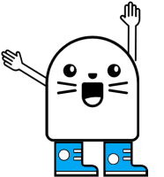
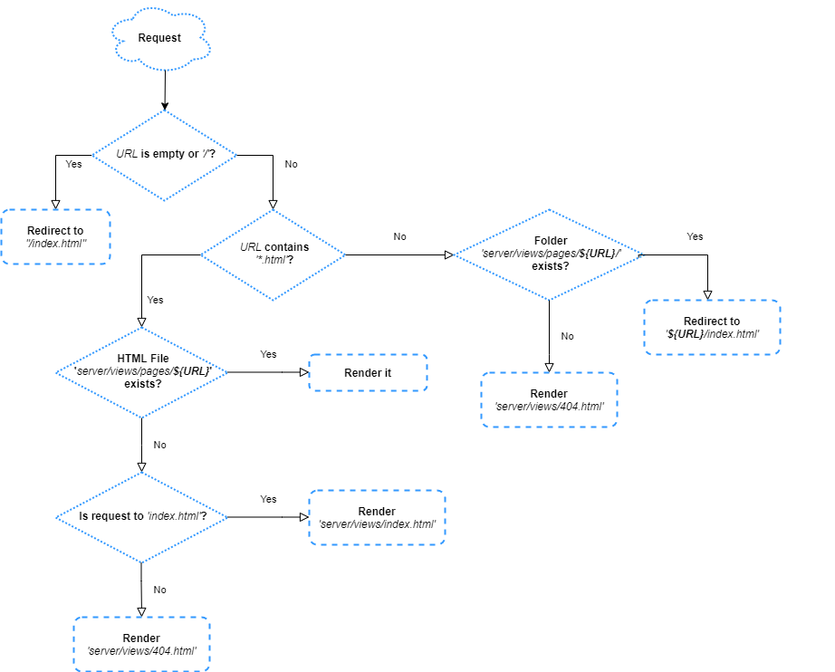

# @exadel/server-sketch




## Overview
Fast, flexible and extensible web-server (🌐) for [Component-Based](#components) architecture/applications 💻. Best for local development and quickly provide POC for business(🧰). Based on [express.js](http://expressjs.com/) web-server.

Has possibility to use by front developers as a part of AEM ([Adobe Experience Manager (TM)](https://www.adobe.com/marketing/experience-manager.html)) development process.

Easy way to quickly [setup](#configuration) and [start server](#how-to-use) for frontend developers(🐜), who doesn't want to spend a lot of time to do it ⌚. 


## How to use
### Install
1) Install **[NodeJs](https://nodejs.org/en/)** (This will also install **npm**)
   Note minimum required version: **NodeJs 20.x** for server-sketch v1
2) Create simple *package.json* (`` npm init ``)
3) Install [@exadel/server-sketch](https://www.npmjs.com/package/@exadel/server-sketch) as dependency for your project (👍):
```shell script
npm i @exadel/server-sketch --save-dev
```

 
### Quick Start
1) Create demo project(structure) _[optional]_:
```shell script
npx server-sketch create-demo-project 
```

2) Start server:
```shell script
npm run server
```

3) Easiest! You can make a ☕ :) 


### Engine
Project based on [express.js](http://expressjs.com/) web server with simple, but useful middleware. 

Template engine for pages: [express-dot-engine](https://www.npmjs.com/package/express-dot-engine) with some improvements.

Default routing based on [folder/file](#routing-based-on-file-system) structure under 📂: ``${PROJECT_ROOT}/server/views/pages/``.

Server supports **[pages](#page)**, **[layouts](#page-template-structure)**, **inheriting pages** (``layout`` property), **[integrated proxy](#popular-options)**, **[partials](#component-view-template)**, **[static resources](#popular-options)**, **[middleware](#extended-options)**, **[multiprojects](#component-folder-structure)**, **[browserSync](https://browsersync.io/) [integration](#popular-options)** and **[reusable components](#components)**.


### Configuration
Configuration object should be passed as a first argument into ``.start()`` function (see ``server/start.js``).

#### Popular options

| Param     | Type      | Default Value     | Description |
|--------   |:------:   |:---------------:  |-------------|
| ``port``  | *{integer}* | **3000**            | Port for your web-server           |
| ``openAfterStart``  | *{string / null}* | **http://localhost:<%= port %>/index.html**            | Automatically open URL after web-server will be started |
| ``optimization``  | *{bool}* | **false**            | Enable optimizations. Cache + gzip + view cache + runtime cache for base router |
| ``cacheTime``  | *{integer}* | **120**            | Cache time (minutes) |
| ``public``  | *[string, ...]* | **['static/']**            | List of folders(📂), where you are stored static resources(images, js, css, json etc.). Relative to server root folder. |
| ``jscssDestFolders``  | *[string, ...]* | **['../.temp/dest/', '../dest/']** | Paths to folders(📂) with generated js & css files(used with ``browserSync.watchAndReload`` & ``public`` options). Relative to server root folder. |
| ``browserSync``  | *{object / null}* | **object** | Enable [BrowserSync](https://browsersync.io/) integration |
| &nbsp;&nbsp;&nbsp;``browserSync.port``  | *{integer}* | **3001** | BrowserSync port |
| &nbsp;&nbsp;&nbsp;``browserSync.watchAndReload``  | *[string, ...]* | **[]** | List of folders(📂) for watching. When it will be changed, then pages will be reloaded |
| ``proxy``  | *{object / null}* | **null** | If you need to use a proxy, you can configure individual requests with the proxies. Usefull to prevent problems with CORS, if you need to have integrating with backend |
| &nbsp;&nbsp;&nbsp;``proxy.rules``  | *[object, ...]* | **[]** | List of proxies. Object format: [below](#proxy-rules-object-format)  |
| &nbsp;&nbsp;&nbsp;``proxy.defaultHost``  | *string / null* | **null** | Default host for "to" params from proxy config [objects](#proxy-rules-object-format) |

#### Proxy rules object format
- ``from``: *{string}* | *[required]* URL on you local web-server. Example: '/service/books/all.json'.  
- ``to``: *{string}* | *[required]* Destination URL for request. Example: 'https://my-backend-api-server.com/service/books/all.json'. (both examples: all requests from '/service/books/all.json' will delegated to 'https://my-backend-api-server.com/service/books/all.json')  
- ``transform(proxyRes, proxyResData)``: *[optional]* Custom response transformer. Should returns transformed data
- ``transformHeaders(headers)``: *[optional]* Custom response headers transformer. Should returns transformed headers


#### Extended options

| Param     | Type      | Default Value     | Description |
|--------   |:------:   |:---------------:  |-------------|
| ``serverRoot``  | *{string}* | **server/**   | Server root folder. |
| ``baseRouter``  | *{string}* | **null**   | Path to base router. It disables default [file-folder routing](#routing-based-on-file-system). Should exports function. First argument will be express app instance. Path should be relative to server folder |
| ``doT``  | *{object}* | **{...}**   | [doT.templateSettings](https://olado.github.io/doT/index.html) |
| ``defaultPageUrl``  | *{string}* | **index.html**   | Default redirection if url doesn't contain ".html". Used by [file-folder routing](#routing-based-on-file-system) |
| ``defaultPageRendition``  | *{string}* | **index.html**   | Default page view(rendition) for URLs: /path/to/index.html. You can customize it here: server/views/index.html.  Used by [file-folder routing](#routing-based-on-file-system) |
| ``views``  | *{string}* | **views/**   |  Path to directory with [views](#page). Relative to server root folder. |
| ``controllers``  | *{string}* | **controllers/**   |  Path to directory(📂) with [page controllers](#api-page-object). Relative to server root folder. |
| ``components``  | *{string}* | **src/**   |  Path to directory(📂) with your [components](#components). Relative to project(cwd) root folder. |
| ``middleware``  | *{string}* | **middleware/*.js**   |  [Middleware for Express](https://expressjs.com/en/guide/writing-middleware.html). Can be array. Js files should export function. Function will retrieve as a first argument: [express app instance](https://expressjs.com/en/4x/api.html) |


### Routing based on file system


### Page
#### Overview
All server pages should be placed under : ``server/views/pages/`` 📂. It can be used as a regular HTML page or can be generated using built-in template engine. 

#### Page template structure
HTML page structure contains 2 sections:

- **Configuration section**: [YAML](https://yaml.org/) at the top. Configuration object(defined between ---) available as ``layout`` object. **Best practice:** use it for global layout configuration(title, body classes, scripts for injection). Default values better to defined in parent page (layout option). Properties are inheritable. **layout** property is reserved and used for showing what is html page to use as a parent.   
    Example:
    ```html
        ---
        layout: '%%PATH_TO_VIEWS%%/layouts/html5.html'
        title: My Page
        bodyClass: my-page
        myCustomNumbers: [1, 2, 3]
        ---
        
        {{##myCustomBlock: 
            <!-- I will available as "layout.myCustomBlock" -->  
        #}}  
    
        {{##body:
            <h1> {{! layout.title }} </h1>
            <div class="url"> {{= page.location.path }} </div>
            <ul class="nums">
            {{~ layout.myCustomNumbers :num }}
                <li> {{! num }} </li>
            {{~}}
            </ul>
        #}}
    ```
- **Definition Blocks Section**: Section with page blocks. **Best Practice:** Split layout with important blocks(see 📂: ``server/views/layouts/`` files). Each block available as property in ``layout`` global object. Example: for previous code ``layout`` object will contain: ``body``, ``myCustomBlock``, ``title``, ``bodyClass``, ``myCustomNumbers`` properties. Minimum 1 definition block (between ``{{##blockName: #}}``) *required*.

Small overview about features you can find in **[Templates](#templates)** section [⏬](#templates). 

#### API: Page object 
``page`` object provide properties for current page rendition(request). That object available in all pages under ``server/views/`` 📂 and for each component (in template).
- ``page.renderComponent(componentName, componentOptions)`` : Render [component](#components) by name with options(returns HTML). Example: ``{{= page.renderComponent('demo/hello-world', { data: 'example1' }) }}`` will render component ``src/demo/hello-world/`` with data ``src/demo/hello-world/data-example1.json`` and pass ``{ data: 'example1' }`` as options. 
- ``page.request``: Express [request](https://expressjs.com/en/4x/api.html#req) object
- ``page.response``: Express [response](https://expressjs.com/en/4x/api.html#res) object
- ``page.location``: Request url object
- ``page.getPageTitle(priorityTitle)``: Calculating page title by request url. If ``priorityTitle`` defined, then it will be used. **Best practice**: define ``priorityTitle`` as a yaml property at the top of the page.
- ``page.resolveURL(url)``: Convert url from absolute to relative for request url. Example: request is: ``/my-project/examples/hi.html``. ``page.resolveURL('/images/log.png')`` will return ``./../../images/log.png``.
- ``page.invokeController(controllerName, ...args)``: Run node JS file from ``server/controllers/${controllerName}.js``. Controller should export function. ``this`` context will be ``page`` object.
- ``page.getFile(fileName)``: Read file. Path should be relative to ``server/`` 📂.
- ``page.initComponent(componentName, componentOptions)``: The same as ``page.renderComponent``, but doesn't generate html(it just create [Component Object](#api-component-object)).


#### Page Controller
Page controller is a js file which exports regular function. JS file should be placed as ``/server/controllers/${controllerName}.js``. Invoke controller you can with [Page API](#api-page-object): ``page.invokeController(controllerName, arg1, arg2, ...)``. ``this`` context in exported function will be **[page object](#api-page-object)**.

**Example 1(run function):**
```js
/* /sever/controllers/log.js */
let i = 0;
module.exports = function (msg) {
    // this === page
    ++i;
    console.log(`${i}. Page: "${this.location.pathname}". Message: "${msg}"`);
}
``` 

```html
<!-- your html page /server/views/pages/**/*.html -->
{{
    page.invokeController('log', 'Some debug message'); 
    page.invokeController('log', 'Another message');
    // see nodejs console
}}
```

**Example 2(extend "page" with new functionality)**:
```js
/* /sever/controllers/createLogger.js */
let i = 0;
module.exports = function () {
    // this === page
    this.log = function (msg) {
        ++i;
        console.log(`${i}. Page: "${this.location.pathname}". Message: "${msg}"`);
    };
}
``` 

```html
<!-- your html page /server/views/pages/**/*.html -->
{{
    page.invokeController('createLogger'); // we extended page with new method ".log(msg)" 
    page.log('Some debug message'); 
    page.log('Another message');
    // see nodejs console
}}
```


### Components
All components should be placed under ``src/`` 📂. **Best practice:** Place all files(related with your component) into component folder. No requirements regarding folder structure, but we recommend to use minimum 2 levels: ``src/${groupName}/${componentName}/``. 
It will help in the future to customize existing components(example: will be created new version of buttons or product cards or new page will be created or redesign existing components 🦄).

#### Component folder structure
Only 1 required file is ``config.json``. It should be placed in your component folder. We recommend to follow next structure:
```js
/server
    start.js <- bootstrap server
    /static <- folder for static files 
        /images
            ...
    /middleware <- folder for middleware 
        ...
    /views
        /layouts <- common pages layouts
            ...
        /pages <- your pages will be here
            ...
/src
    /${groupName} <- group name it is smthg like a scope
        /${componentName}
            /ui <- we recommend put UI resources(js, css(less, scss), images, templates etc. what are using in browser) into "ui"  folder
                ${componentName}.js (optional)
                ${componentName}.less (.scss) (optional)
                ${componentName}.hbs (template which is using in browser) (optional)
                ...
            config.json <- JSON file with component configuration. Required.
            data-***.json <- JSON files with predefined data. Helps to prevent copy/paste data between usages. Optional.
            ${componentName}.html <- Server side component template(component rendition). Any name can be used. See "config.json > view" property. 
            ${componentName}Controller.js <- Any server side js logic related with component. Optional.
        /${componentName2}
            ...
```  
#### config.json
``config.json`` file reserved properties (see demo project: "/src/demo/header/config.json"):
- ``view``:*(required)* Path to server side component html template.
- ``controller``:*(optional)* Path to js file with server side logic related with component. File should export object(will be prototype for your component object). ``init()`` function is required, but you can add another methods for you component and then call them in template. See demo project: "/src/demo/header/HeaderController.js". More details & examples: [Extend Component](#extend-component)
- ``data``:*(optional. deprecated)*. Contains predefined data for component. Better to store data in ``data-***.json`` files.  

#### API: Component object
``component`` object available in component server side templates. You can extend object with ``controller`` property in ``config.json`` file.
- ``component.renderComponent(componentName, componentOptions)``: The same as ``page.renderComponent(componentName, componentOptions)``. See: **["API: Page Object"](#api-page-object)** section
- ``component.initComponent(componentName, componentOptions)``: The same as ``page.initComponent(componentName, componentOptions)``. See: **["API: Page Object"](#api-page-object)** section
- ``component.render()``: Generate HTML for component and fill with data.
- ``component._getFile(filePath)``: Get file content. Path should be *relative* to component folder.
- ``component.config``: JSON from *"config.json"*. See description in: **[config.json](#configjson)** section.
- ``component.data``: JSON from _"data-***.json"_ file or *"data"* value (if object) from component options. See description in: **[Component options](#component-options)** section.
- ``component.name``: Component name.
- ``component.id``: Unique component ID.
- ``component.options``: Component options (second argument in call **.renderComponent(componentName, componentOptions)**). See description in: **[Component options](#component-options)** section.
- ``component.mayCustomMethod(arg1, arg2, ...)``: Any method declared in object exported by js defined via *"config.json > controller"* property.

#### Extend Component
Component's controller helps developer to extend [base component API](#api-component-object) with new functionality.

Controller is a regular js object(prototype), which exported from js file. Path to js file you can define in [config.json](#configjson) (``controller`` property).

``init()`` function is required, but you can add another methods for you component and then call them in template.

**NOTE:** If you have changed controller content(js file), you need to restart server (because it uses native ``require()`` and ``module.exports`` - cached).

**Example 1:**

*/src/my-math/numbers/config.json*
```json
{
  "view": "NumbersView.html",
  "controller": "NumbersController.js" 
}
```

*/src/my-math/numbers/NumbersController.js*
```js
module.exports = {
    init() {
        // this === component
        // Will be invoked, when component has been created
        console.log(`"${this.name}" was created.`);         
    },

    // Extend base component with new functionality
    getPositiveNumbers(nums = []) {
        // this === component
        return nums.filter((num) => num > 0);
    },
    getNegativeNumbers(nums = []) {
        // this === component
        return nums.filter((num) => num < 0);
    }
}
```

*/src/my-math/numbers/NumbersView.html*
```html
<div class="c-numbers">
    <div><strong>Positive numbers:</strong> {{= component.getPositiveNumbers([-1, 10, 100, 0, -200, -345]).join(',') }}</div>
    <div><strong>Negative numbers:</strong> {{= component.getNegativeNumbers([-1, 10, 100, 0, -200, -345]).join(',') }}</div>
</div>
```

#### Component options
Any object can be passed. Reserved properties:
- ``data``: Dataset for component(pre filled data). Can be **string** or **object**. Accessible via ``component.data`` property or ``data`` in [component template](#component-view-template).
    - ``string``: Dataset will be read from **${componentName}/data-${dataValue}.json** file. You can use **@extend: "path/to/data-parent.json"** notation. It helps to prevent copy-past data between json files. 
    - ``object``: Will be used as it is.

#### Component view (template)
Currently our system allow to use only [doT.js](https://olado.github.io/doT/index.html) templates. Small overview you can find in **[Templates](#templates)** section. 

Next objects are available in component view:
- ``page``: page object. See: **["API: Page Object"](#api-page-object)** section.
- ``component``: component object. See: **["API: Component Object"](#api-component-object)** section.
- ``data``: Component data. Shortcut for ``component.data``.
- ``options``: Component init options. Shortcut for ``component.options``.
- ``partial(data)``: Function to inject HTML from another file.
 
### Templates
Small overview what features can be used in our **[page](#page-template-structure)** & **[component](#component-view-template)** templates(views). Full documentation you can find [here](https://olado.github.io/doT/index.html).
- ``{{ js_code }}``: Evaluate javascript code on server side. Example: 
```js
{{
    let myFileContent = component._getFile('./my-file.txt');
    console.log(`Request to: ${page.request.originalUrl}`);
    const rndm = Math.random() * 1000;
}}
```  
- ``{{= expression }}``: Interpolation. Print expression result. Example: 
```js
File content: {{= myFileContent )) 
Random number: {{= Math.random() }}
Button component: {{= page.randomComponent('demo/button', { data: { title: 'My button' } }) }}
```
- ``{{! expression }}``: Interpolation with encoding. The same as regular interpolation, but safer(prevent script injection). 
- ``{{? condition }}``:	Conditionals. Example:
```html
{{? data.image }}  {{?}}
{{? Math.random() > 0.5 }}
    <!-- if: number is bigger than 0.5 -->
{{??}}
    <!-- else: (0.5 and lower) -->
{{?}}    
```
- ``{{~ arrayList :item:index }} ...iteration block... {{~}}``: Array iteration(``arrayList.forEach(function (item, index) { ...iteration block... });``). ``item`` and ``index`` can be any variables. 
```html
<ul>
{{~ ['hello', 'world', 'frontend'] :word:index }}
    <li> {{! index }} {{! word }} </li>
{{~}}
</ul>
```


### Command Line Interface
See: [@exadel/server-sketch-cli](https://www.npmjs.com/package/@exadel/server-sketch-cli) | [git](https://github.com/exadel-inc/server-sketch-cli)

### FAQ
Will be updated. If you have any questions(❓) or ideas(💡) or bugs(🐞), you can ask with "[Issues](./../../issues)". We are open to help you: 🌞

#### AEM / ui.frontend integration
Our server is more easier way for frontend developers to work on projects with AEM backend.

**Installing:**
1) Go to ui.frontend folder: ``cd ui.frontend``
2) Then regular [Install](#install)
3) Configure it (maybe, need to add folder, with your css & js bundles to ``jscssDestFolders`` option)

**Approach:**

Main idea - frontend developers should working in their ecosystem and should not touch AEM on implementing phase.
1) Frontend developers are working in ``ui.frontend`` folder
2) New components will be placed under: ``ui.frontend/src/${groupName}/${componentName}`` structure.
3) ui resources for your component should be placed under: ``ui.frontend/src/${groupName}/${componentName}/ui/`` folder.
4) Frontend developers are implementing components views with doT.js
5) After, when component will be ready, AEM developer can migrate it to HTL template engine (we are going to add supporting [HTL](https://experienceleague.adobe.com/docs/experience-manager-htl/using/getting-started/getting-started.html?lang=en#getting-started) on sketch-server in the future)

**NOTE**: Server Sketch doesn't provide any API to build css & js resources for your project. It is up to you.


### Roadmap
TBD

### Features
- [x] [file-folder routing](#routing-based-on-file-system)
- [x] Flexible templates
- [x] Pages
- [x] Layouts
- [x] Components
- [x] JSON data for components
- [x] Controllers
- [x] OOTB BrowserSync integration 
- [x] etc. 

### Links 
- [@exadel/server-sketch](https://www.npmjs.com/package/@exadel/server-sketch) | [git](https://github.com/exadel-inc/server-sketch)
- [@exadel/server-sketch-cli](https://www.npmjs.com/package/@exadel/server-sketch-cli) | [git](https://github.com/exadel-inc/server-sketch-cli)
- [Exadel Inc. Github](https://github.com/exadel-inc/) | [web-site](https://exadel.com)

🧰 

---
**Exadel, Inc.**

[](https://exadel.com)
